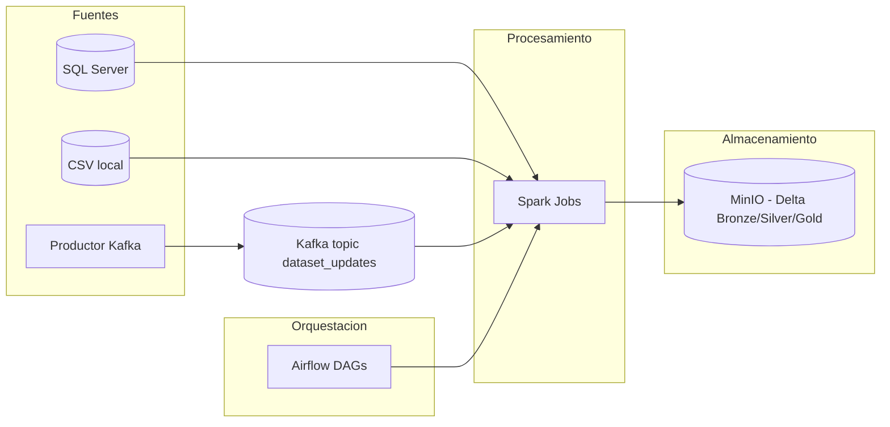
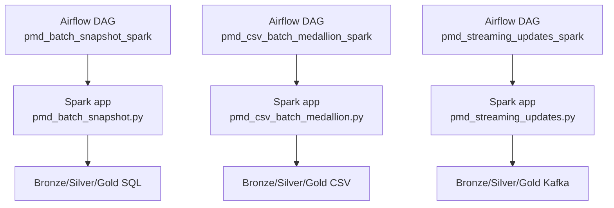

# Trabajo final PMD y ASBD - Catalogo de metadatos de datasets

Proyecto Big Data reproducible para portfolio, basado en un caso de uso realista:
mantener un catalogo de datasets actualizado combinando batch y streaming con
arquitectura Medallion (Bronze/Silver/Gold) sobre Delta Lake.

## Resumen ejecutivo

- Objetivo: catalogo vivo de metadatos de datasets con ingesta batch y streaming.
- Arquitectura: SQL Server + CSV + Kafka -> Spark (Delta) -> MinIO.
- Orquestacion: Airflow para batch y control de ejecucion.
- Resultados: salidas Gold y previews locales listos para visualizacion.

## Pipelines principales

- Batch estructurado incremental desde SQL Server.
- Batch semiestructurado desde CSV.
- Streaming Kafka con join con batch (Silver SQL) y ventanas.

## Diagramas (Mermaid)

### Arquitectura general



### Relacion DAGs vs Spark Apps



## Estado y objetivos

- Cumple variedad y velocidad: datos estructurados, semiestructurados y streaming real.
- Orquesta tareas en Airflow con cron, macros temporales, bifurcacion, XCom/TaskFlow, sensores y conexion entre DAGs (ASBD).
- Usa Delta Lake con capas Bronze/Silver/Gold en cada pipeline (PMD).

## Arquitectura y componentes (resumen)

- SQL Server: fuente estructurada y base para ingesta incremental.
- CSV local: fuente semiestructurada con campos JSON embebidos.
- Kafka: broker para eventos de cambios incrementales.
- Productor Kafka (Python): genera eventos en tiempo real fuera de Airflow.
- Spark: procesamiento batch y streaming con Delta Lake.
- MinIO: almacenamiento S3 local para Bronze/Silver/Gold.
- Airflow: orquestacion de procesos batch y requisitos ASBD.

## Resultados visibles

- Salidas Delta en MinIO (Bronze/Silver/Gold).
- Previews locales generados automaticamente al final de cada pipeline:
  `docs/visualizaciones/` con `preview.csv` y `preview.jsonl`.

## Ejecucion rapida (local)

1) Entrar al directorio de docker compose:

```bash
cd docker-compose
```

2) Verificar el archivo `.env` con el identificador de usuario de Airflow:

- En Linux o WSL:

```bash
echo -e "AIRFLOW_UID=$(id -u)" > .env
```

- En Windows (PowerShell):

```powershell
"AIRFLOW_UID=1000" | Set-Content -NoNewline .env
```

3) Levantar servicios:

```bash
docker compose up -d --build
```

4) Accesos utiles:

- Airflow: http://localhost:8085 (usuario y clave: airflow / airflow)
- Spark Master UI: http://localhost:8080
- MinIO Console: http://localhost:9001 (minioadmin / minioadmin123)
- Jupyter: http://localhost:8888
- Kafka externo: localhost:9094
- SQL Server: localhost:1433 (usuario: sa, clave: Password1234%)

## Documentacion principal

- Propuesta de producto y requisitos PMD: `docs/propuesta-producto-big-data.md`
- Documentacion completa del proyecto: `docs/documentacion-completa.md`
- Arquitectura PMD (pipelines y Medallion): `docs/arquitectura-pmd.md`
- Orquestacion en Airflow y requisitos ASBD: `docs/arquitectura-airflow.md`
- Guia unica de ejecucion y pruebas: `docs/ejecucion-y-pruebas.md`

## Estructura del repositorio

- `docker-compose/` Entorno reproducible con Airflow, Spark, Kafka, SQL Server y MinIO.
- `pipelines/dags/` DAGs organizados por carpetas (real / test / maintenance).
- `pipelines/spark-apps/` Jobs Spark de los pipelines PMD.
- `pipelines/data/` Datos locales (CSV) montados en Spark.
- `docs/` Documentacion funcional y tecnica del proyecto.
- `docs/visualizaciones/` Previews locales (CSV/JSONL) generados al final de cada pipeline.
