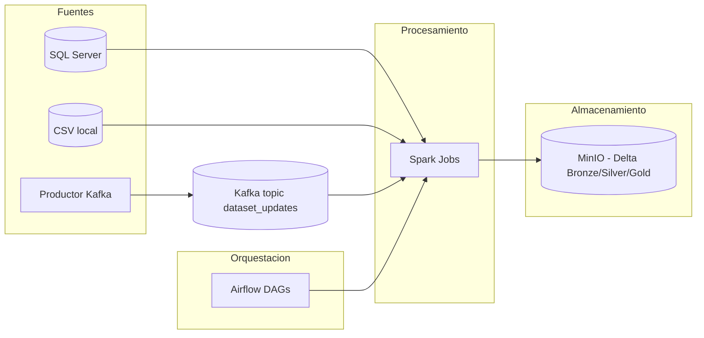
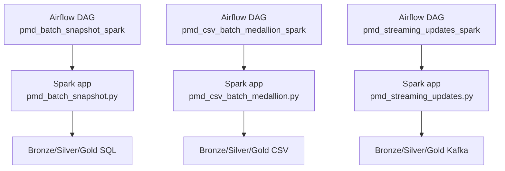

# Trabajo final PMD y ASBD - Catalogo de metadatos de datasets

Este repositorio implementa una propuesta sencilla y reproducible de producto Big Data para las asignaturas Procesamiento Masivo de Datos (PMD) y Arquitectura de Sistemas Big Data (ASBD). La propuesta limita el alcance a pipelines claros y demostrables.

La idea central es mantener un catalogo vivo con tres pipelines (Medallion + Delta):
- Batch estructurado incremental desde SQL Server.
- Batch semiestructurado desde CSV.
- Streaming Kafka con join con batch.

## Diagramas (Mermaid)

### Arquitectura general



### Relacion DAGs vs Spark Apps



## Estado y objetivos

- Cumple variedad y velocidad: datos estructurados, semiestructurados y streaming real.
- Orquesta tareas en Airflow con cron, macros temporales, bifurcacion, XCom/TaskFlow, sensores y conexion entre DAGs (ASBD).
- Usa Delta Lake con capas Bronze/Silver/Gold en cada pipeline (PMD).

## Ejecucion rapida (local)

1) Entrar al directorio de docker compose:

```bash
cd docker-compose
```

2) Verificar el archivo `.env` con el identificador de usuario de Airflow:

- En Linux o WSL:

```bash
echo -e "AIRFLOW_UID=$(id -u)" > .env
```

- En Windows (PowerShell):

```powershell
"AIRFLOW_UID=1000" | Set-Content -NoNewline .env
```

3) Levantar servicios:

```bash
docker compose up -d --build
```

4) Accesos utiles:

- Airflow: http://localhost:8085 (usuario y clave: airflow / airflow)
- Spark Master UI: http://localhost:8080
- MinIO Console: http://localhost:9001 (minioadmin / minioadmin123)
- Jupyter: http://localhost:8888
- Kafka externo: localhost:9094
- SQL Server: localhost:1433 (usuario: sa, clave: Password1234%)

## Documentacion principal

- Propuesta de producto y requisitos PMD: `docs/propuesta-producto-big-data.md`
- Documentacion completa del proyecto: `docs/documentacion-completa.md`
- Arquitectura PMD (pipelines y Medallion): `docs/arquitectura-pmd.md`
- Orquestacion en Airflow y requisitos ASBD: `docs/arquitectura-airflow.md`
- Guia unica de ejecucion y pruebas: `docs/ejecucion-y-pruebas.md`

## Estructura del repositorio

- `docker-compose/` Entorno reproducible con Airflow, Spark, Kafka, SQL Server y MinIO.
- `pipelines/dags/` DAGs organizados por carpetas (real / test / maintenance).
- `pipelines/spark-apps/` Jobs Spark de los pipelines PMD.
- `pipelines/data/` Datos locales (CSV) montados en Spark.
- `docs/` Documentacion funcional y tecnica del proyecto.

## Alcance actual del TFM (fase base)

El trabajo se centra en construir una base reproducible que permite avanzar en el TFM: catalogo de datasets, pipelines batch/streaming con Delta, y orquestacion con Airflow. Los objetivos mas avanzados de DCAT-AP se consideran logros futuros posibles y no forman parte del alcance de esta fase.

### Logros futuros posibles (fuera de alcance en esta fase)

- Analizar la estructura y los elementos de un modelo de catalogo interoperable.
- Implementar pipeline de ingestion desde una fuente externa (por ejemplo CKAN).
- Validar la configuracion mediante exportacion o federacion en formato compatible con estandares de catalogo.
- Evaluar beneficios y limitaciones de la configuracion en interoperabilidad y mantenimiento.
